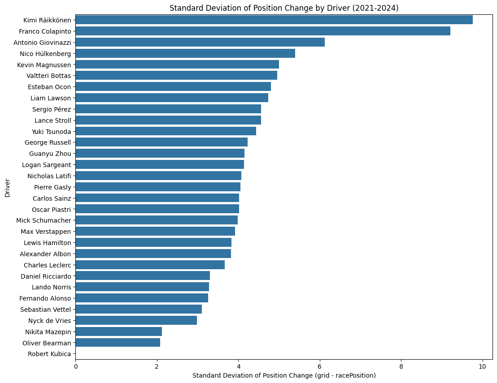
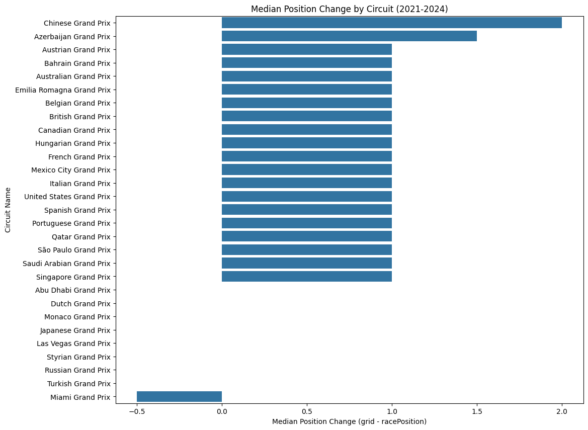

# F1 Race Performance Analysis (2021–2024)

This project analyzes the relationship between **qualifying positions** and **final race results** in Formula 1 seasons (2021–2024).  

It explores what， why & how factors influence drivers' performance。

---

## Project Overview

This project analyzes Formula 1 race data from the 2021 to 2024 seasons to understand the dynamics of position changes during a race. The primary goal is to investigate the factors that influence whether a driver gains or loses positions relative to their starting grid spot.

**Data Sources:**  
- Kaggle Formula 1 Dataset (https://www.kaggle.com/datasets/rohanrao/formula-1-world-championship-1950-2020/data)

---

## Methods & Techniques

**Data Pipeline (SQLite):**
1. Load: All raw CSV files from the F1dataset are loaded into a local SQLite database (f1_project.db) using a Python script (with glob, os, and pandas.to_sql).

2. Transform: A SQL script (create_tables_script) JOIN six tables (races, results, drivers, constructors, qualifying, status) into a new, clean "master" table (master_analysis_data) for reusebale. Then creates a second, pre-filtered table (master_finished_analysis_data) with finished status only for easier analysis.

3. Analyze: Now the notebook reads directly from this clean database using pandas.read_sql_query, and can easily grab needed data for each topic.

**Exploratory Data Analysis (EDA):**

- Visualized correlations, distributions, average, median, and standard deviation using matplotlib and seaborn.

- Analyzed position changes (grid - racePosition), incident frequencies, and performance by circuit type using its Average (Mean), Median, and Standard Deviation (SD) to provide a comprehensive performance picture.

 
---

## Key Findings

**Driver Performance:**

The average (mean) position change is a misleading metric, easily skewed by a few outlier races.

The median is a better indicator of typical performance. It revealed that veteran drivers in midfield teams (like Vettel and Räikkönen) were the strongest "Race-Day Overperformers".

Standard Deviation (SD) effectively measured consistency. Top-tier drivers (like Verstappen) showed low SD (consistent results), while others (like Räikkönen) were highly volatile.

**Circuit Performance:**

The initial hypothesis that incidents = unpredictability was disproven.

Monaco has a high incident count but one of the lowest SDs, meaning the races are predictable and processional despite the chaos.

Russia had few incidents but the highest SD, suggesting track layout (long straights, DRS) is a much stronger driver of variability than incident count.

**Circuit Type Performance:**

A median analysis confirmed that a typical race on a Low-Speed circuit results in a 0.0 position change, while High and Medium speed tracks typically see a +1.0 position gain.

The Standard Deviation was similarly high across all track types, indicating that all modern F1 races feature a high degree of unpredictability.
---

## Tech Stack

- **Languages**: Python, SQL

- **Data Stack**: Pandas, NumPy, SQLite

- **Visualization**: Matplotlib, Seaborn

- **Modeling** (WIP): Scikit-learn

- **Tools**: Jupyter Notebook, Git, GitHub, SQLite Database

---

## Author

**Yicong Yang**  
Undergraduate Student in Computer Science @ University of Virginia  
Email address: sekiroy21@gmail.com

---
